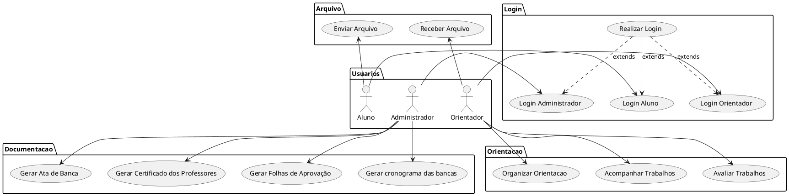

# Especificação dos Requisitos do SITCC

## Requisitos Funcionais

### Lista de Requisitos Funcionais

- RF01 - Realizar Login
- RF02 - Login Orientador
- RF03 - Login Aluno
- RF04 - Login Administrador
- RF05 - Organizar Orientacao
- RF06 - Acompanhar Trabalhos
- RF07 - Avaliar Trabalhos
- RF08 - Gerar Ata de Banca
- RF09 - Gerar Certificado dos Professores
- RF010 -Gerar Folhas de Aprovação
- RF011 - Gerar cronograma das bancas
- RF012 - Enviar Arquivo
- RF013 - Receber Arquivo

### Diagrama de Casos de Uso

### Especificicações de Casos de Uso

- [UC_01](reqs_UC01.md)
- [UC_02](reqs_UC02.md)
- [UC_03](reqs_UC01.md)
- [UC_04](reqs_UC01.md)
- [UC_05](reqs_UC01.md)
- [UC_06](reqs_UC01.md)
- [UC_07](reqs_UC01.md)
- [UC_08](reqs_UC01.md)
- [UC_09](reqs_UC01.md)
- [UC_010](reqs_UC01.md)
- [UC_011](reqs_UC01.md)
- [UC_012](reqs_UC01.md)
- [UC_013](reqs_UC01.md)

## Requisitos não-funcionais

### Usabilidade

... Segundo ... Nilsen ...

## Referências

[1] Nilsen ...

[2] Ian Somerville ...

[3] Angular ...

[4] PlantUML ...
